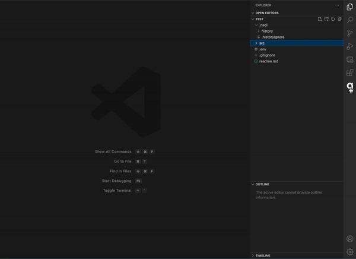
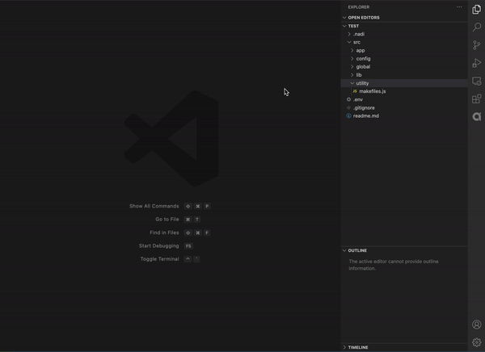

# Nadi VSCode Extension

## Description
Record and present daily recorded file changes.

## Main Features
- Records daily changes of files in the working project directory.
- Create a directory or file recursively inside the working project directory.


## How to use the extension
1. Open recorded history from Nadi icon in the sidebar.
2. Open the Command Palette via the shortcut specific to your OS:

- on OSX: Press `^⌘F` (aka `CONTROL+CMD+N`) to create file or press `^⌘F` (aka `CONTROL+CMD+F`) to create folder recursively
- on Windows: Press `Ctrl+Shift+N`` then type Press `Ctrl+Alt+N` to create file or press `Ctrl+Alt+F` to create folder recursively

3. Right-click on a file or folder in explorer and select "NADI History: Ignore File/Folder" to select a file or folder to ignore from the historical recording.


Command | Description
--- | ---
```NADI: Create File``` | Create file recursively inside working directory.
```NADI: Create Folder``` | Create folder recursively inside working directory.

## Output samples

### View Recorded File Changes.


### Create File/Folder Recursively.


### 1.0.3

Initial release of NADI VSCode Extension

## License
[MIT License](LICENSE)